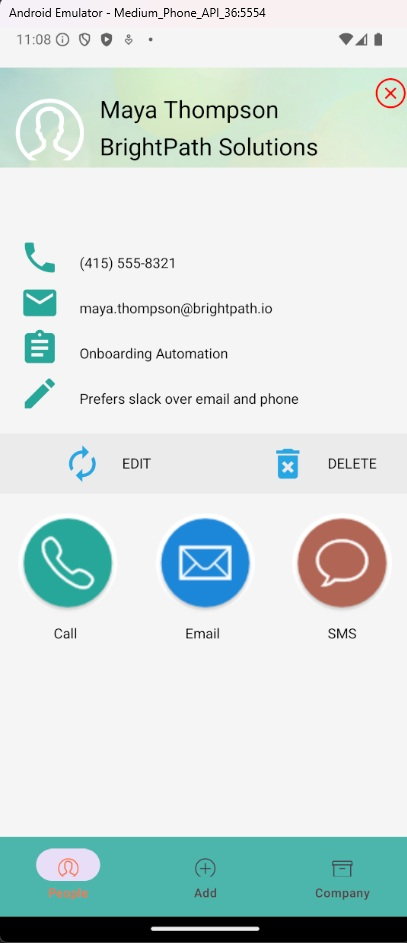

# Link Up

## Design and Purpose

This app is a basic CRM (Customer Relationship Management) tool for keeping track of business contacts. It works like a contact manager, but with extra features for organizing work-related information.

You can save details like a person’s name, phone number, email, company, project, and notes. All contacts show up in a grid view, and when you tap on someone, you’ll see their full details, including their role. From there, you can call, text, or email them, or update or delete their information.

There’s also a tab that shows a list of companies. When you select a company, you’ll see all the employees who work there.

This app is made for people who need a simple way to manage their work contacts, like freelancers, small business owners, or team managers.

## Screenshots

<table>
  <tr>
    <td></td>
    <td>
      This screen shows the People tab of the app. Each contact is displayed in a card with their name and company clearly shown. The layout is scrollable, allowing users to quickly browse through all saved business contacts. At the bottom, there’s a navigation bar with three tabs: People, Add, and Company for easy access to different sections of the app.
    </td>
  </tr>
</table>

<table>
  <tr>
    <td></td>
    <td>
      This screen shows the Add tab, where users can enter a new business contact. The form includes fields for first name, last name, phone number, email, company, project, notes, and country. Required fields are marked with an asterisk (*). Once all necessary information is filled out, users can tap the ADD button to save the contact. This form helps users quickly and easily organize key details for future reference.
    </td>
  </tr>
</table>

<table>
  <tr>
    <td></td>
    <td>
     This screen shows the Company tab of the app. It displays a list of companies, each represented by a card. Under each company name, the employees associated with that company are listed with their names in labeled badges. Each badge also includes the employee’s country flag for quick visual reference. This view helps users understand the structure of their contacts by grouping individuals under the organizations they belong to.
   </td>
  </tr>
</table>

<table>
  <tr>
    <td></td>
    <td>
    This screen shows the detailed view of a contact—in this case, Maya Thompson from BrightPath Solutions. It displays all essential information, including phone number, email, project name, and personal notes. At the top, there’s a close button to exit the view. Below the contact info, there are Edit and Delete options for managing the contact. At the bottom, users can quickly choose to Call, Email, or send an SMS using large, clearly labeled buttons. This layout makes it easy to both view and take action on a contact with minimal effort. 
    </td>
  </tr>
</table>

### Walkthrough of our App

1. Go to the Add tab and enter the contact's details like name, phone number, email, company, project, and notes and country. Tap ADD to save.
2. Open the People tab to view all saved contacts in a scrollable card layout.
3. Tap on a contact to see full details. From there, you can edit or delete the contact, or call, text, or email them directly.
4. Use the Company tab to view contacts grouped by the companies they work for, making it easy to manage business relationships.

## API Design

We use Express to expose endpoints for managing contact data stored in MongoDB.

### POST /contact

Creates a new contact in the database.

```js
export const addNewContact = (req, res) => {
  let newContact = new Contact(req.body);
  newContact.save((err, contact) => {
    if (err) res.send(err);
    res.json(contact);
  });
};

app.route('/contact').post(addNewContact);
```

### GET /contact

Retrieves a list of all contacts.

```js
export const getContacts = (req, res) => {
  Contact.find({}, (err, contact) => {
    if (err) res.send(err);
    res.json(contact);
  });
};

app.route('/contact').get(getContacts);
```

### GET /contact/:contactId

Retrieves details of a specific contact using its ID.

```js
export const getContactWithID = (req, res) => {
  Contact.findById(req.params.contactId, (err, contact) => {
    if (err) res.send(err);
    res.json(contact);
  });
};

app.route('/contact/:contactId').get(getContactWithID);
```

### PUT /contact/:contactId

Updates the details of an existing contact.

```js
export const updateContact = (req, res) => {
  Contact.findByIdAndUpdate(
    { _id: req.params.contactId },
    req.body,
    { new: true },
    (err, contact) => {
      if (err) res.send(err);
      res.json(contact);
    }
  );
};

app.route('/contact/:contactId').put(updateContact);
```

### DELETE /contact/:contactId

```js
export const deleteContact = (req, res) => {
  Contact.deleteOne({ _id: req.params.contactId }, (err) => {
    if (err) res.send(err);
    res.json({ message: 'Successfully deleted contact' });
  });
};

app.route('/contact/:contactId').delete(deleteContact);
```

## External API Used

We used a helper function to generate the correct flag URL based on a contact's country. Country names are mapped to ISO 2-letter codes.

```js
const countryNameToCode = {
  Canada: "ca",
  Germany: "de",
  India: "in",
  // ... other countries
};

const getFlagUrl = (country) => {
  if (!country) return null;
  const code = countryNameToCode[country.trim()];
  if (!code) return null;
  return `https://flagcdn.com/24x18/${code}.png`;
};

{getFlagUrl(name.country) && (
  <Image
    source={{ uri: getFlagUrl(name.country) }}
    style={styles.flag}
    resizeMode="cover"
  />
)}
```

## Experiences

### Issues and Solutions

- **UI Refresh Issue after Add/Update**  
  After adding or updating a person, changes didn’t immediately reflect in the UI. This was because navigating back to the list screen did not auto-refresh the data.  
  *Solution:* We used `navigation.navigate` along with simple state hooks to manually trigger re-fetching in both `PeopleList.js` and `UpdatePerson.js`.

- **No Relational Link Between Companies and Contacts**  
  The `company` field in each contact is stored as a string, meaning if a company name changes, no automatic update is reflected across its associated contacts.  
  *Solution:* In `CompanyList.js`, we used manual filtering (`people.filter(p => p.company === companyName)`) to group contacts under companies dynamically. This avoids the need for backend joins and simplifies frontend logic.

- **Consistent State Across Screens**  
  Ensuring that all screens showed updated contact data after any addition or edit was challenging without duplicating fetch logic.  
  *Solution:* We introduced Redux for global state management, using selectors like:
  ```js
  const mapStateToProps = (state) => {
    const { firstName, lastName, phone, email, company, project, notes, _id } = state;
    return { firstName, lastName, phone, email, company, project, notes, _id };
  };
  ```

### Team Process

- Used **Discord** for team communication and coordination.
- Managed source code using **Git** with version control best practices.
- Followed **modular development**, separating backend into:
  - Routes
  - Controllers
  - Models
- On the frontend, we developed and reused **component-based UI**.
- Maintained **consistent naming conventions** throughout the codebase.
- Employed **Redux** for shared state management to avoid redundancy.

### Modules and Techniques Used

- **Frontend:** React Native  
- **Database:** MongoDB (NoSQL)  
- **Server:** Node.js with Express  
- **Operations:** Full CRUD using HTTP methods (`GET`, `POST`, `PUT`, `DELETE`)

### Future Work

- Implement **basic user authentication** using JWT or OAuth.
- Enable **multi-user support** to allow each user to manage separate contact lists.
- Add **search functionality** for quickly locating contacts, companies, or projects.
- Improve the **UI/UX design** to make the app more visually appealing and intuitive.
